Dokumentation\
AKWI Change Prozess

 Inhaltsverzeichnis 
==================

[Inhaltsverzeichnis](#inhaltsverzeichnis)

[Aufgabenstellung / Anforderungen](#aufgabenstellung-anforderungen)

[Prozessmodell](#prozessmodell)

[BPMN](#bpmn)

[Beschreibung des Prozessmodells](#beschreibung-des-prozessmodells)

[Technische Umsetzung](#technische-umsetzung)

[jekyll-Projekt „AKWI\_res"](#jekyll-projekt-akwi_res)

[Website „AKWI\_website"](#website-akwi_website)

[emailjs](#emailjs)

[Website „akwiJsonToFuseki"](#website-akwijsontofuseki)

[Testing](#section)

[Fallstudie](#fallstudie)

[Testberichte](#testberichte)

[Hierarchie - Beschränkungen beim Einfügen und Löschen](#hierarchie---beschränkungen-beim-einfügen-und-löschen)

 Aufgabenstellung / Anforderungen
================================

Die Website akwi.de wurde anhand des Pagebuilders jekyll mit dem plugin
jekyll-rdf erzeugt. Ziel war es, das jekyll-Projekt so anzupassen, dass
die Website 12 zusätzliche Kontaktformulare erhält. Für die Elemente:
Hochschule, Fakultät, Studiengang und Person sollte je ein Formular für
das Einfügen, Löschen und Ändern erstellt werden. Außerdem sollte ein
Konzept entwickelt werden, wie Nutzer der AKWI-Webseite Änderungen an
derselben Stelle beantragen können und ein Webadministrator über diese
Änderungswünsche informiert wird und die Änderungen an der Website
möglichst automatisiert umsetzen kann.

Prozessmodell
=============

Das Konzept wurde anhand des folgenden BPMN-Prozesses dargestellt:

BPMN
----

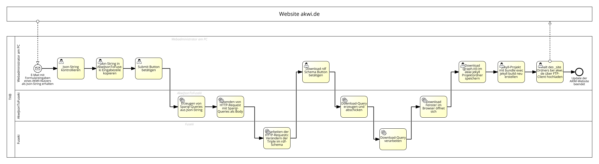

Beschreibung des Prozessmodells
-------------------------------

Der AKWI-Nutzer beantragt eine Änderung der Website (bspw. das
Hinzufügen einer Kontaktperson), indem er das entsprechende Formular
ausfüllt und abschickt. Der Webadministrator des AKWI (Webadmin) erhält
eine E-Mail-Benachrichtigung. Die E-Mail enthält einen Json-String, der
die Formulareingaben des Nutzers als strukturierte Daten enthält. Der
Webadmin kopiert den Json-String in das entsprechende Textfeld der
Webanwendung \"akwiJsonToFuseki\" und drückt den Submit Button.
AkwiJsonToFuseki wandelt den json-String in Sparql-Queries um und sendet
die Sparql-Queries an Fuseki. So wird der Datenbestand in Fuseki
verändert, also Delete, Insert oder Update Transaktionen durchgeführt.
(Fuseki ist ein Triple-Store, der rdf-Schema speichert und diese
verwaltet.) Anschließend drückt der Webadmin in akwiJsonToFuseki auf den
Download Button, was dazu führt, dass die aktuelle Version des
rdf-Schemas (graph.ttl) von Fuseki heruntergeladen wird. Der Webadmin
fügt die graph.ttl in den Ordner \_data des jekyll-Projektes ein und
führt bundle exec jekyll build aus, um die html-Seiten der Webseite neu
zu generieren. Die Inhalte des Ordners \_site lädt der Webadmin anhand
eines FTP-Clienten in den Ordner mitglieder der Website. Nun sind die
vom Nutzer beantragten Änderungen der Website aktiv.

 Technische Umsetzung
====================

Das obige Prozessmodell wurde in drei wesentlichen Entwicklungsprojekten
(„AKWI\_res", „AKWI\_website", „akwiJsonToFuseki") erstellt. Nachfolgend wird auf
diese eingegangen.

Unter http://fbw-sgmwi.th-brandenburg.de/akwi/AKWI\_website/ befindet
sich eine Testversion der AKWI-Website. Unter
http://fbw-sgmwi.th-brandenburg.de/akwi/akwiJsonToFuseki/ befindet sich
das Tool akwiJsonToFuseki. Unter
http://fbw-sgmwi.th-brandenburg.de:3030/index.html befindet sich der
verwendete Apache Jena Fuseki Server. Das zu Testzwecken verwendete
RDF-Schema auf dem Fuseki Server heißt akwi\_graph\_test.

jekyll-Projekt „AKWI\_res"
--------------------------

AKWI_res steht für AKWI Repository. Die Inhalte
des Unterordners /mitglieder der AKWI-Website werden anhand dieses
Projekts erzeugt. Das Projekt nutzt jekyll und das Plugin jekyl rdf. Zu
jeder Ressource (also Instanz von Hochschule, Fakultät, Person,
Studiengang) des AKWI RDF-Schemas wird eine html-Seite erzeugt, wenn
jekyll build ausgeführt wird.

Die untere Graphik zeigt das AKWI RDF-Schema:

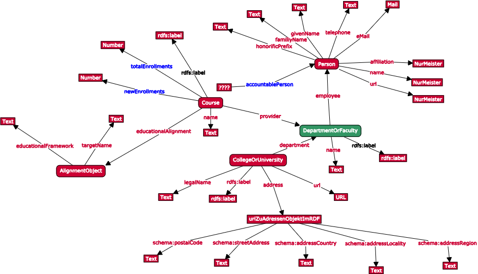AKWI\_res 

Das Projekt wurde um Kontaktformulare erweitert, die es ermöglichen,
Hochschulen, Fakultäten, Studiengänge und Personen einzufügen, zu
bearbeiten sowie zu löschen. Die Abbildung unten zeigt die Buttons. Plus
bedeutet hinzufügen, Minus entfernen und das Zahnrad bearbeiten. Bei
Klick auf einen Button öffnet sich das entsprechende Kontaktformular als
Modal.

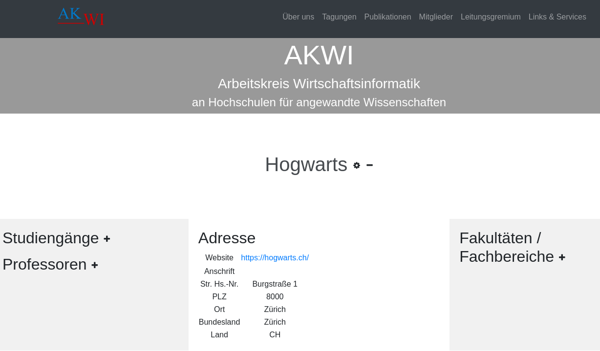

Als Beispiel soll das Kontaktformular \"Hochschule bearbeiten\" auf
Quellcode-Ebene betrachtet werden.

Die Abbildung unten zeigt den Dateibaum des jekyll-Projektes. Der Ordner
\_data enthält die graph.ttl, also das RDF-Schema. Der Ordner\_includes
enthält Code, der von anderen Dateien importiert wird. Diese
jekyll-Funktionalität wurde von uns genutzt, um den liquid-Code aus den
html-Dateien auszulagern und ihn möglichst an einem Ort (den \_includes
Ordner) einsehen zu können. Der \_layouts Ordner enthält html-Dateien,
die den Rahmen für die Objekte aus jekyll RDF bilden. Es wurde von uns
ein Layout für jeden Objekttyp angelegt (Hochschule, Fakultät,
Studiengang, Person).

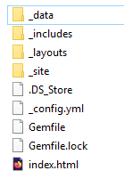\
Das Kontaktformular \"Hochschule bearbeiten\" ist entsprechend im Layout
bezüglich der Hochschule (in der Datei \"collegeOrUniversity.html\")
enthalten. Zu Beginn wird mit  der
liquid-Code importiert, der in der Abbildung unten gezeigt wird.

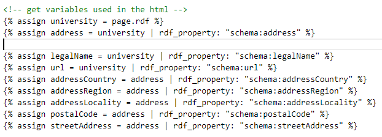

Page.rdf ist das Objekt der aktuellen Seite, also hier eine konkrete
Hochschule. Von diesem Objekt ausgehend lassen sich durch den liquid
Filter rdf\_property Attributwerte zu der Hochschule aus dem rdf-Schema
auslesen. Die Attributwerte werden anschließend auf Variablen
gespeichert. Bspw. enthält die Variable postalCode dann die
Postleitzahl. In der \"collegeOrUniversity.html\" werden die Variablen
dann ausgelesen und in den html-Quellcode geschrieben. Die Abbildung
unten enthält den Teil des Quellcodes, wo die Variablen postalCode und
streetAddress in den html-Quellcode geschrieben werden (an den Stellen
{{ postalCode }} sowie {{ streetAddress }} ).

Im Frontend der Webseite bewirkt dies, dass in den
Formular-Input-Feldern bzgl. Postleitzahl (PLZ), Straße (Str.) und
Nummer (Nr.) die Werte im Kontaktformular voreingetragen sind. Die
Abbildung unten zeigt das Formular für Hochschule beantragen bezüglich
der Hochschule Hogwarts (die testweise angelegt wurde). Für PLZ, Str.
und Nr. wurden die Werte 8000 sowie Burgstraße 1, die aus dem rdf-Schema
ausgelesen wurden, eingetragen.

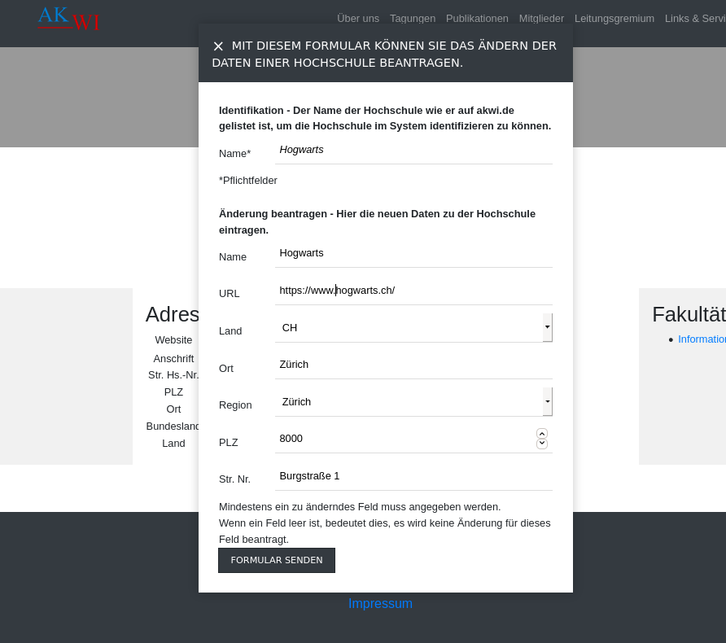

Das Design der Formulare wurde mit dem Framework bootstrap, genauer mit
der Klasse \"modal\", umgesetzt.

Wie in dem Dateibaum oben ersichtlich gibt es noch den \_site Ordner.
Nachdem der Befehl jekyll build ausgeführt wurde, enthält der Ordner zu
jeder Ressource des AKWI eine html-Seite. Der Inhalt des Ordners wird in
den Ordner mitglieder der AKWI Website kopiert. Die Formulare enthalten
kein Capture zum Absenden, da sie sich später nur in dem
mitglieder-Ordner befinden. Der Ordner wird später durch eine
htaccess-Datei gesperrt und nur für Mitglieder des AKWI zugänglich sein.

Website „AKWI\_website"
-----------------------
Dieses Teilprojekt enthält den gesamten Inhalt der Website akwi.de. Die
Abbildung unten zeigt den Dateibaum auf oberster Ebene:

Der Ordner js enthält im Wesentlichen die Prozesslogik für die Formulare, die mit JavaScript umgesetzt wurden.
Wenn auf absenden geklickt wird, wird die Formular-Eingabe validiert,
also bspw. geprüft, ob alle Pflichtfelder ausgefüllt wurden.
Anschließend wird aus den Formularfeldern ein Json-String erstellt. Der
Json-String und eine E-Mail-Benachrichtigung wird in hidden Input-Felder
geschrieben und anschließend an emailjs.com gesendet.

Im nachfolgenden Abschnitt wird auf emailjs eingegangen.

Die AKWI Website hatte schon vor Beginn des Projektes existiert. Unsere
Aufgabe in diesem Bereich war es vor allem aufzuräumen, um den Quellcode
leserlicher und verständlicher zu machen. Die Dateien enthielten html-,
JavaScript-, Css-Quellcode gemischt. Durch unsere Refactoring-Arbeiten
enthält der js Ordner den JavaScript-Teil, der css Ordner den Css-Teil.
Die html-Seiten importieren die Inhalte aus den beiden Ordnern und
enthalten sonst nur html-Code. Durch diese Importe konnten auch
Redundanzen (kopierter Quellcode) entfernt werden.

### emailjs
EmailJs (emailjs.com) ist eine JavaScript-library zum Senden von
E-Mails, wobei kein eigener Backendserver (bspw. php) benötigt wird. Die
Website akwi.de verwendet diese library, um über Formulare an den
Webadmin E-Mails zu schicken.

**Einrichtung und Funktionsweise**
Man erstellt einen Account bei emailjs.com. Anschließend kann man in
seinem persönlichen Bereich einen email service hinzufügen. Bezüglich
des email service wird ein E-Mail-Account (hier ein gmail-Account)
hinterlegt. Dem email service wird des Weiteren ein email template
zugewiesen. Die Formulareingaben, die von der Website (hier akwi.de)
gesendet werden, kommen als Variablen bei emailjs.com an. Diese
Variablen werden in das email template geschrieben, sodass ein E-Mail
Text und eine Betreffzeile erstellt werden. Nachdem der E-Mail-Inhalt so
erzeugt wurde, schickt emailjs.com die E-Mail an den im email service
hinterlegten gmail-Account.

Die untenstehende Abbildung zeigt das email template der AKWI-Website.
In die Variablen {{ message }} und {{ data }} werden die
Formulareingaben gebunden.

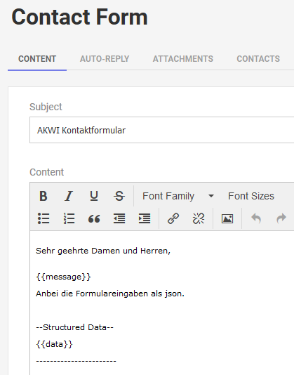

Nachfolgend wird auf das Erstellen eines Kontaktformulars mit emailjs
eingegangen:

Laden der library

Zunächst wird die emailjs library in das html-Dokument geladen:

\--

\<script type=\"text/javascript\"

src=\"https://cdn.jsdelivr.net/npm/emailjs-com\@2.4.1/dist/email.min.js\"\>

\</script\>

\--

Authentifikation

Dann findet die Authentifikation mit dem email service statt, wobei die
User-ID benötigt wird. Die User-ID kann unter Account -\> API KEYS
nachgelesen werden.

\--

emailjs.init(\'YOUR\_USER\_ID\');

\--

Formular

In dem folgenden Beispiel wird ein Formular gezeigt. Die ID
\"contact-form\" ist der Name des email template, das für das Formular
verwendet werden soll. Telephone wird als Variable an emailjs.com
gesendet und in das email template contact-form an der Stelle wo {{
telephone }} steht, eingebunden.

\--

\<form id=\"contact-form\"\>

\<input name=\"telephone\"\>

\</form\>

\--

Formular abschicken

Folgende Funktion sendet das Kontaktformular an emailjs.com:

\--

emailjs.sendForm(\'contact\_service\', \'contact\_template\',
formular\_id);

\--

contact\_service ist die Service ID des email service auf emailjs.com.

contact\_template ist die ID des verwendeten email template auf
emailjs.com.

formular\_id ist das sendende html-form-Element als JavaScript-Objekt.
Es kann zuvor durch getElementByID geholt werden.

Website „akwiJsonToFuseki"
--------------------------

Das dritte Teilprojekt „akwiJsonToFuseki" ist im Wesentlichen eine auf
JavaScript basierende Webanwendung, die einen eingegebenen Json-String
in einen SPARQL-Query überführt und den SPARQL-Query zu einem
SPARQL-Endpunkt (hier ein Apache Jena Fuseki Server) sendet. Die
Abbildung unten zeigt das Frontend des Projektes. In die Eingabezeile
wird der Json-String eingetragen und anschließend auf den Button
\"submit data\" geklickt. Mit dem Button \"download akwi graph from
Fuseki\" kann das RDF-Schema heruntergeladen werden.

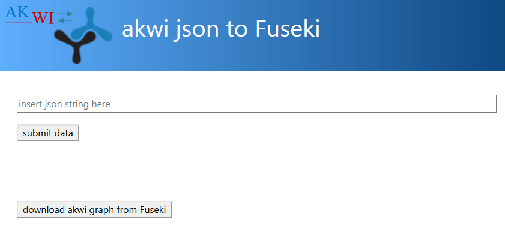

**Json-String**

Der Json-String, der in die Eingabezeile eingetragen wird, muss einer
bestimmten Struktur entsprechen. Die Abbildung unten zeigt beispielhaft
einen Json-String, um eine Hochschule einzufügen.

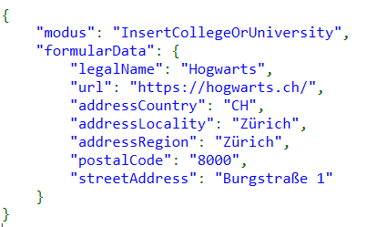

Das Attribut modus gibt den Namen des Modus an, den das Programm
verwenden soll, um den JsonString zu verarbeiten. Es gibt insgesamt 12
Modi. Je einen um eine Hochschule, eine Fakultät, einen Studiengang und
eine Person einzufügen, zu bearbeiten oder zu löschen. Das Attribut
formularData enthält die Formulareingaben der AKWI-Website. Die
Attributnamen von formularData entsprechen dabei den IDs der
Formularfelder auf akwi.de. Der Inhalt des Inputfelds mit der ID
legalName ist im JsonString unter dem Attributnamen legalName
aufgeführt.

**Dateibaum und Modus**

Anhand des Modus wird der Weg durch das Programm ausgewählt. Die
Abbildung unten zeigt die Switch Case, anhand der der Name des Modus
verarbeitet wird:

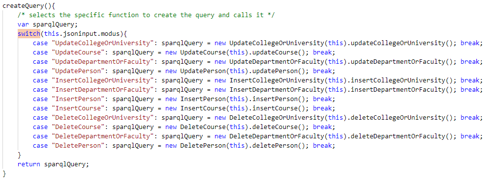

Für jeden der 12 Anwendungsfälle wurde eine JavaScript-Klasse erstellt.
Die JavaScript-Klasse InsertCollegeOrUniversity.js hat bspw. die Aufgabe
den Json-String mit dem Modus InsertCollegeOrUniversity in den
SPARQL-Query zu überführen, der eine Hochschule in dem RDF-Schema
anlegt. Die Abbildung unten zeigt die Java-Script-Klassen. In config.js
wird u. a. die URL zu dem SPARQL-Endpunkt eingetragen.
FusekiConnector.js enthält das Hauptprogramm und die eben aufgeführte
Funktion createQuery ist aus ihr entnommen.

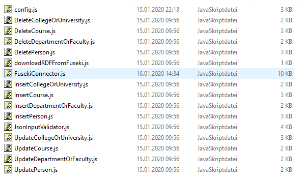

**\
SPARQL-Query erzeugen**

Die Funktion insertCollegeOrUniversity aus der Klasse
CollegeOrUniversity wird im Folgenden betrachtet (siehe Abbildung
unten).

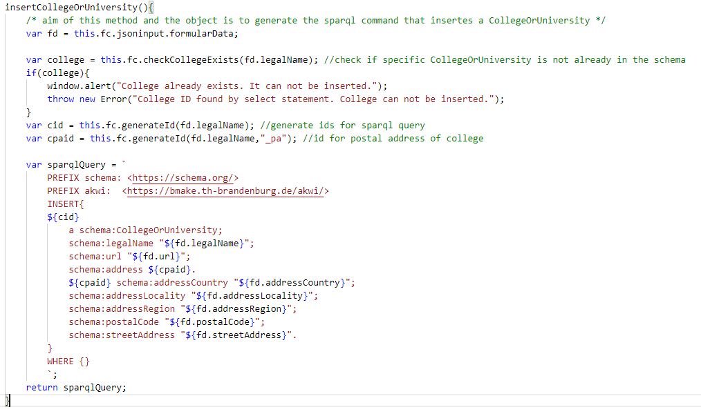

Zunächst werden die ID für die Hochschule (cid für college id) und die
ID für die Postadresse der Hochschule (cpaid für college postal address
id) generiert. Fd steht für formularData und ist ein Objekt, dass die
Formulareingaben in seinen Attribut-Werte-Paaren enthält. Um den
SPARQL-Query zu erzeugen, werden die Attributwerte aus fd ausgelesen und
in einen String eingebunden. Die Variable sparqlQuery enthält am Ende
den folgenden SPARQL-Query (siehe Abbildung).

**\
SPARQL-Query an Fuseki senden**

Die query Funktion aus der Klasse FusekiConnector.js wird in der
folgenden Abbildung gezeigt.

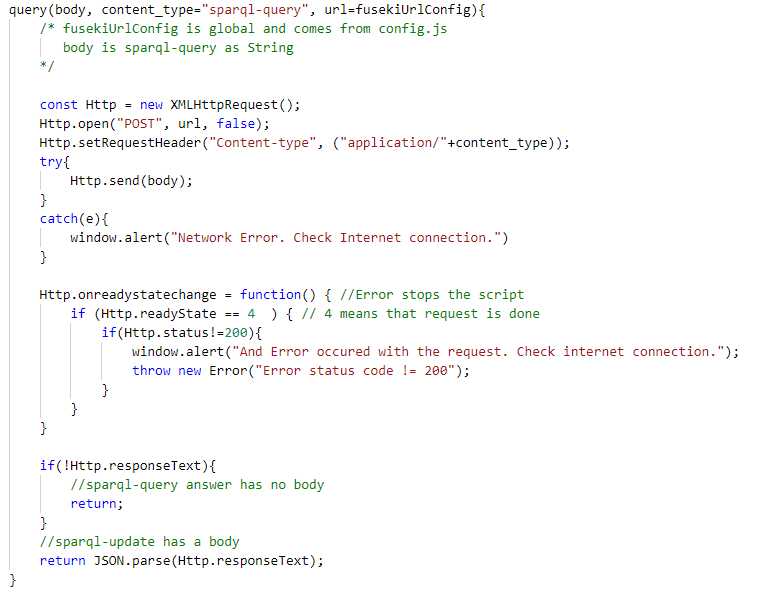

Der Parameter body enthält den SPARQL-Query als String. Es wird ein
XMLHttpRequest-Object erzeugt. Bei der Kommunikation mit dem Fuseki
Server muss ein Header gesetzt werden, damit Fuseki weiß, ob es sich um
einen lesenden oder einen schreibenden Befehlsaufruf handelt. Der Header
application/sparql-update bezeichnet einen schreibenden SPARQL-Query,
der Header application/sparql-query einen lesenden SPARQL-Query. Für das
Einfügen der Hochschule muss der Header application/sparql-update
verwendet werden. Anschließend wird im try-catch-Block versucht den
SPARQL-Query an die REST-Schnittstelle des Fuseki-Servers zu senden, mit
dem Funktionsaufruf Http.send(body);. Der Fuseki-Server antwortet auf
erfolgreiche Http-Requests immer mit einem JSON-Dokument. Wenn der
Http-Request erfolgreich war, wird das JSON-Dokument in JavaScript
eingelesen und von der Funktion zurückgegeben.

 {#section .list-paragraph}

Testing 
=======

Fallstudie
----------

Es folgt eine Fallstudie, die die Funktion und das Zusammenspiel der
einzelnen Systeme verdeutlichen soll. Es wird vor allem die Interaktion
der Benutzer mit den Systemen gezeigt.

Fallstudie Hogwarts

Wir schreiben das Jahr 2020. Albus Dumbledore hat die Idee, eine
Außenstelle von Hogwarts in der Schweiz zu gründen, um Muggle-Schüler
unter anderem in Informationstechnologien zu unterrichten. Er erwägt die
schweizerische Großstadt Zürich als geeigneten Standort. Die neue Schule
wird damit im Einzugsbereich des AKWI liegen. Nachdem die Bauarbeiten
abgeschlossen sind und der Lehrbetrieb aufgenommen wurde, möchte
Dumbledore seine neue Lehreinrichtung mit anderen Hochschulen vernetzen.
Im Internet stößt er auf die Website des AKWI (akwi.de). Er nimmt
Kontakt mit dem Webadmin des AKWI auf und erhält Zugang zum
Mitgliederbereich, wo er Daten zu seiner Hochschule eintragen kann. Sie
schlüpfen nachfolgend abwechselnd in die Rollen von Dumbledore, der
Änderungen an der AKWI Website beantragt und in die Rolle des
AKWI-Webadministrators (Webadmin), der die Änderungen an der AKWI
Website im System übernimmt.

**(1) Hochschule beantragen**

Dumbledore beantragt eine Hochschule.

Er geht auf die Seite
<http://fbw-sgmwi.th-brandenburg.de/akwi/AKWI_website/index.html> und
dort in den Reiter Mitglieder.

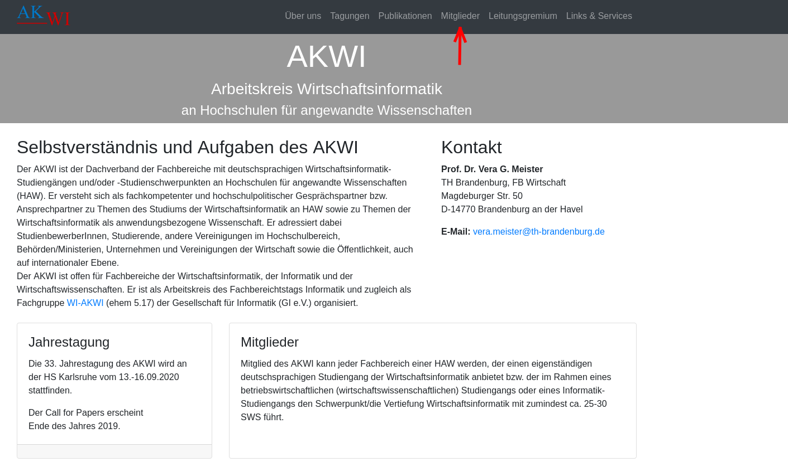

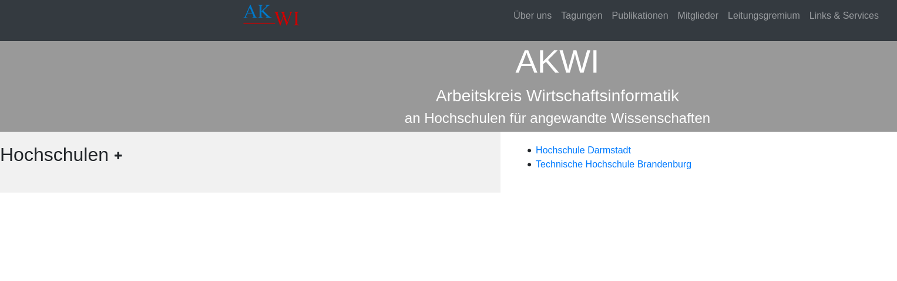

Er verwendet folgende Anschrift:

Hogwarts

https://hogwarts.ch/

CH

Zürich

Zürich

8000

Burgstraße 1

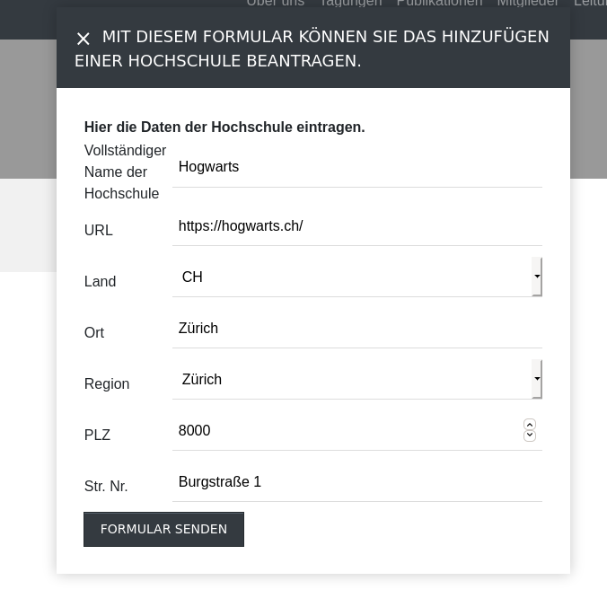**(2) Startseite der Hochschule erstellen**

Der Webadmin übernimmt die beantragten Änderungen im System und
aktualisiert die AKWI Website.

Der Webadmin hat eine E-Mail erhalten. Am Ende der E-Mail befinden sich
die Formulareingaben von Dumbledore als json-String.

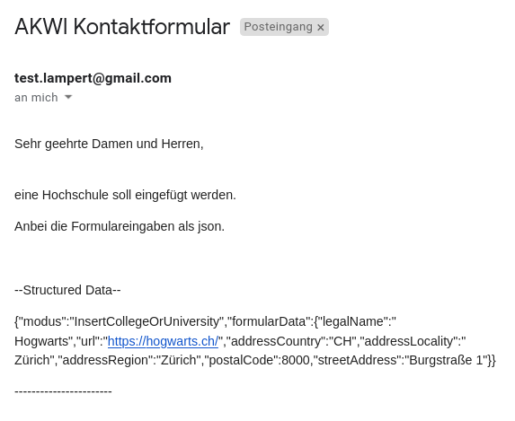

\--Structured Data\--

{\"modus\":\"InsertCollegeOrUniversity\",\"formularData\":{\"legalName\":\"Hogwarts\",\"url\":\"https://hogwarts.ch/\",\"addressCountry\":\"CH\",\"addressLocality\":\"Zürich\",\"addressRegion\":\"Zürich\",\"postalCode\":8000,\"streetAddress\":\"Burgstraße
1\"}}

\-\-\-\-\-\-\-\-\-\-\-\-\-\-\-\-\-\-\-\-\-\--

Er klickt 3 Mal hintereinander in den Bereich und kopiert sich die
json-Daten anschließen mit STRG+C in den Zwischenspeicher.

Die kopierten Daten werden von dem Webadmin auf Korrektheit hin
überprüft und ggf. korrigiert.

Der Webadmin öffnet das Tool akwiJsonToFuseki, das sich auf der Seite
<http://fbw-sgmwi.th-brandenburg.de/akwi/akwiJsonToFuseki/> befindet.

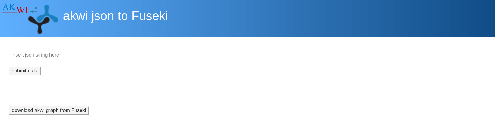

Dort kopiert er den Json-String in das Eingabefeld hinein und drückt auf
\"submit data\".

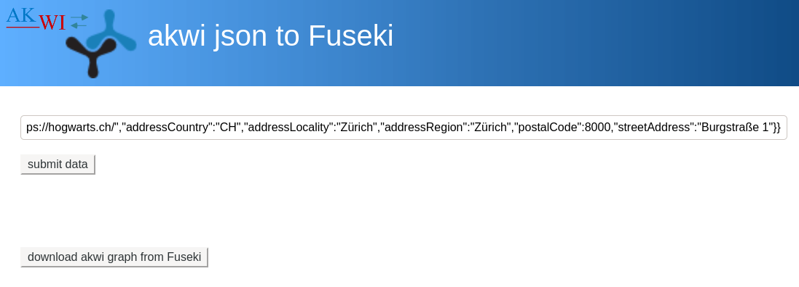

Bei Erfolg meldet sich akwiJsonToFuseki wie folgt zurück.

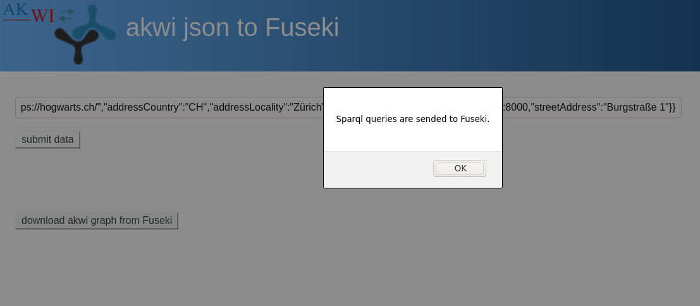

Die Änderungen wurden nun im rdf-Schema akwi\_graph\_test übernommen.
Der verwendete Triplestore, der das rdf-Schema enthält, ist ein Apache
Jena Fuseki Server. Dieser ist unter der URL
<http://fbw-sgmwi.th-brandenburg.de:3030/> erreichbar.

Der Webadmin lädt nun durch klicken auf \"download akwi graph from
Fuseki\" das aktuelle rdf-Schema \"akwi\_graph\_test\" vom besagten
Apache Jena Fuseki Server herunter. Die Datei graph.ttl wird in
Downloads gespeichert.

Der Webadmin kopiert die graph.ttl aus dem Downloads-Ordner. In das
jekyll-Projekt AKWI\_res unter dem Unterordner \_data hinein. Er ersetzt
damit die bestehende graph.ttl-Datei.

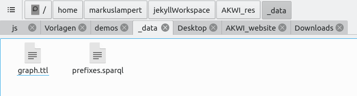

Mit dem Terminal navigiert er in den Projektordner des jekyll-Projektes
(hier AKWI\_res) und führt den Befehl \"bundle exec jekyll build\" aus,
um die html-Dateien des Mitgliederbereichs neu zu erzeugen.

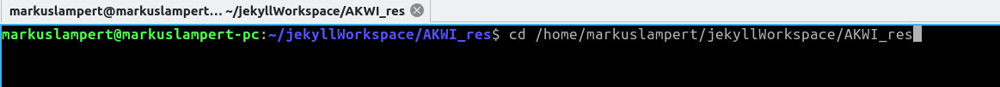

Nun greift der Webadmin mit einem FTP-Clienten auf den Webserver zu, der
die Website hostet (hier \"fbw-sgmwi.th-brandenburg.de\"). Er kopiert
den Inhalt von AKWI\_res/\_site/ (Ordner auf dem PC) in mitglieder
(Ordner des Mitgliederbereichs auf dem Webserver).

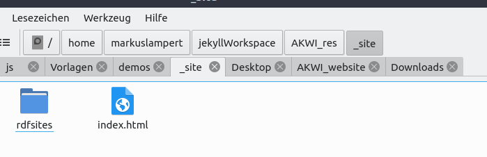

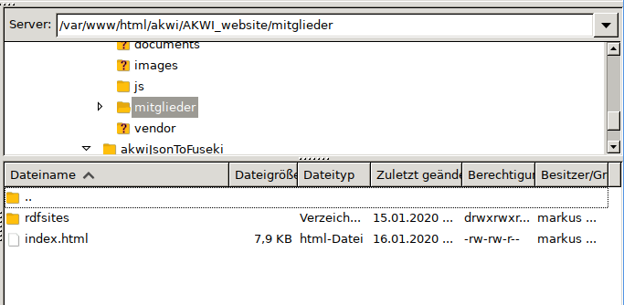

-   Auf der Website erscheint nun die Hochschule \"Hogwarts\".

Dumbledore kann nun auf dieser Seite weitere Personen, Fakultäten und
Studiengänge zu seiner Hochschule beantragen. Damit sich die jetzt noch
leere Seite mit Informationen füllt.

Testberichte
------------

Die Webseite implementiert insgesamt 12 Anwendungsfälle. Die Fallstudie
hat bereits einen, nämlich das Einfügen einer Hochschule, beschrieben.
Für die weiteren Anwendungsfälle sollen die Formulareingaben, der per
E-Mail gesendete json-String sowie die resultierende Website gezeigt
werden.

**Fakultät einfügen**

Formular-Eingabe

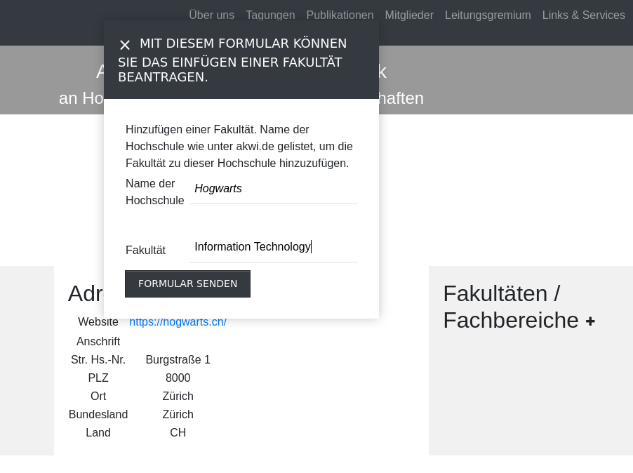

json-String

{\"modus\":\"InsertDepartmentOrFaculty\",\"formularData\":{\"legalName\":\"Hogwarts\",\"name\":\"Information
Technology\"}}

Resultat

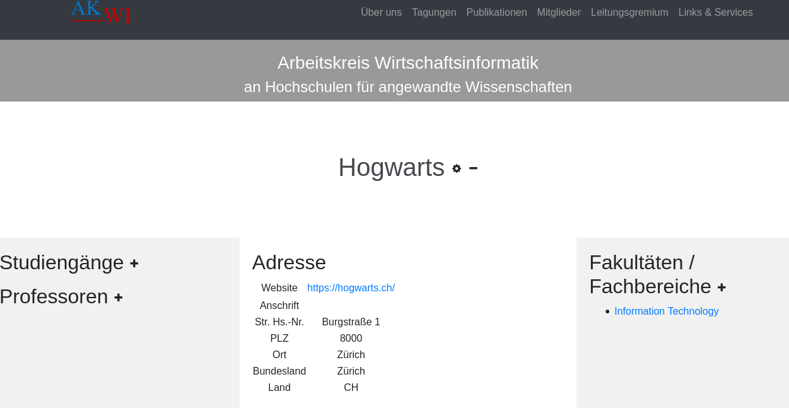

**Studiengang einfügen**

Formular-Eingabe

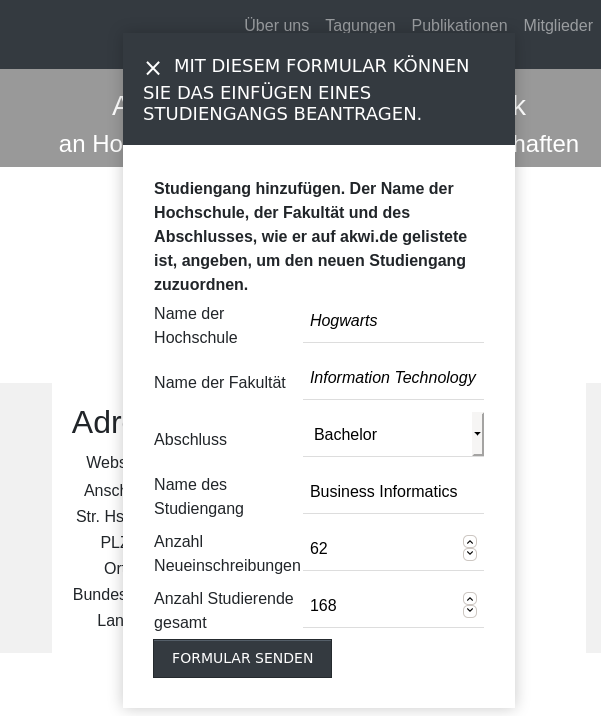

json-String

{\"modus\":\"InsertCourse\",\"formularData\":{\"legalName\":\"Hogwarts\",\"facultyName\":\"Information
Technology\",\"targetName\":\"Bachelor\",\"name\":\"Business
Informatics\",\"newEnrollments\":62,\"totalEnrollments\":168}}

Resultat

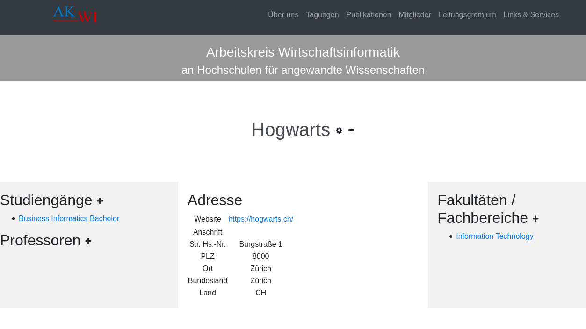

**Person einfügen**

Formular-Eingabe

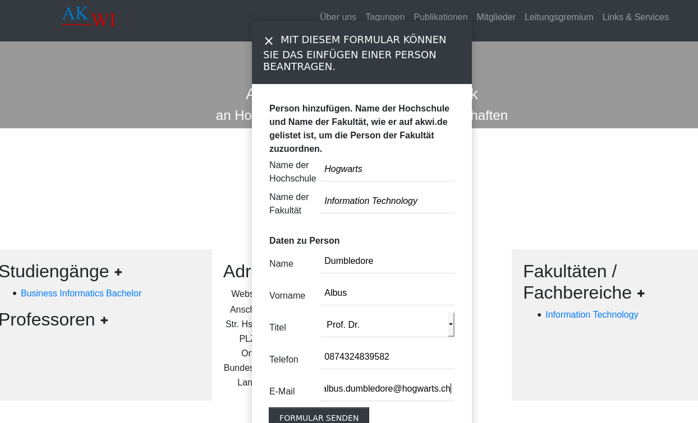

json-String

{\"modus\":\"InsertPerson\",\"formularData\":{\"legalName\":\"Hogwarts\",\"name\":\"Information
Technology\",\"familyName\":\"Dumbledore\",\"givenName\":\"Albus\",\"honorificPrefix\":\"Prof.
Dr.\",\"telephone\":874324839582,\"eMail\":\"albus.dumbledore\@hogwarts.ch\"}}

Resultat

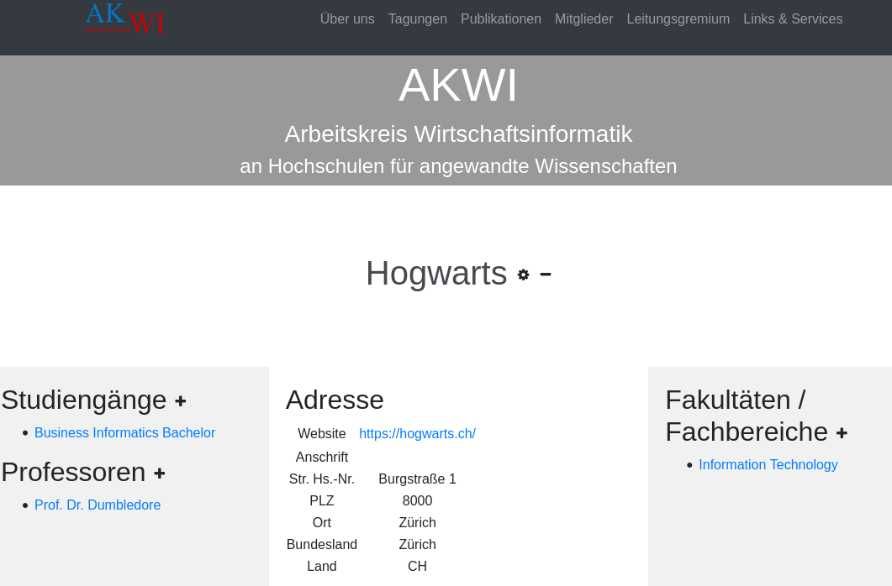

**Hochschule ändern**

Formular-Eingabe

-\> URL hogwarts.ch wird geändert zu www.hogwarts.ch

json-String

{\"modus\":\"UpdateCollegeOrUniversity\",\"formularData\":{\"id\_legalName\":\"Hogwarts\",\"legalName\":\"Hogwarts\",\"url\":\"https://www.hogwarts.ch/\",\"addressCountry\":\"CH\",\"addressLocality\":\"Zürich\",\"addressRegion\":\"Zürich\",\"postalCode\":8000,\"streetAddress\":\"Burgstraße
1\"}}

Resultat
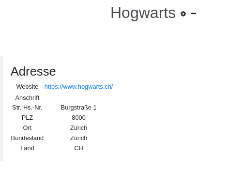

**Fakultät ändern**

Formular-Eingabe

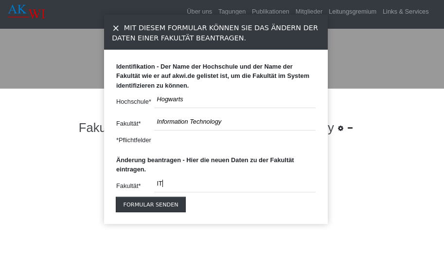

-\> Name der Fakultät ändert sich von \"Information Technology\" zu
\"IT\"

json-String

{\"modus\":\"UpdateDepartmentOrFaculty\",\"formularData\":{\"id\_legalName\":\"Hogwarts\",\"id\_name\":\"Information
Technology\",\"name\":\"IT\"}}

Resultat

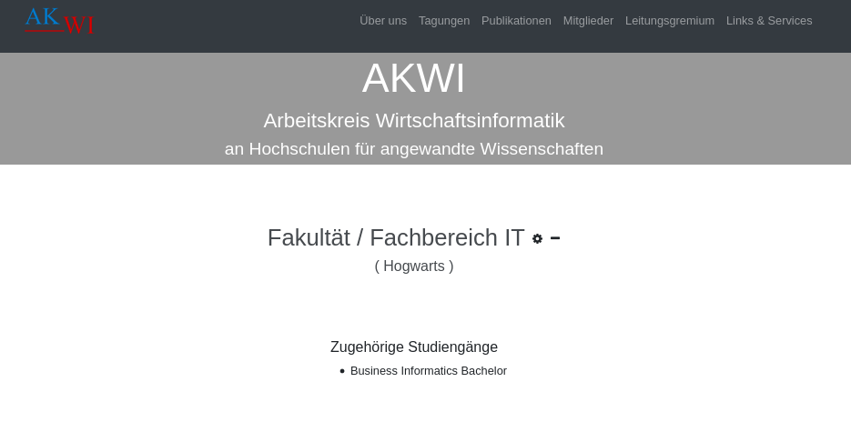

**Studiengang ändern**

Formular-Eingabe

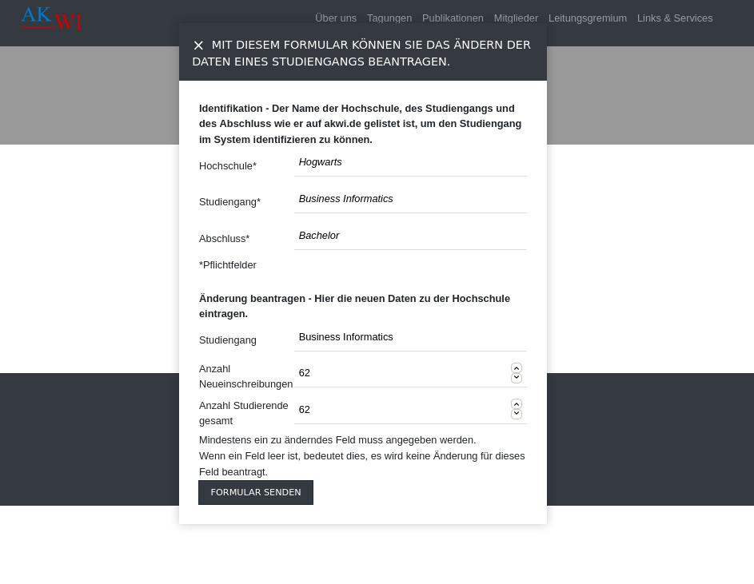

-\>Studierende insgesamt von 168 auf 62 ändern.

json-String

{\"modus\":\"UpdateCourse\",\"formularData\":{\"id\_legalName\":\"Hogwarts\",\"id\_name\":\"Business
Informatics\",\"id\_targetName\":\"Bachelor\",\"name\":\"Business
Informatics\",\"newEnrollments\":62,\"totalEnrollments\":62}}

Resultat

**Person ändern**

Formular-Eingabe

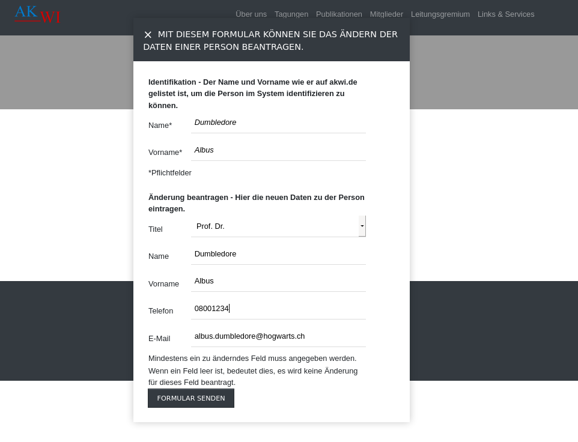

-\>Die Telefonnummer ändert sich von 874324839582 auf 08001234

json-String

{\"modus\":\"UpdatePerson\",\"formularData\":{\"id\_familyName\":\"Dumbledore\",\"id\_givenName\":\"Albus\",\"honorificPrefix\":\"Prof.
Dr.\",\"familyName\":\"Dumbledore\",\"givenName\":\"Albus\",\"telephone\":8001234,\"eMail\":\"<albus.dumbledore@hogwarts.ch>\"}}

Resultat

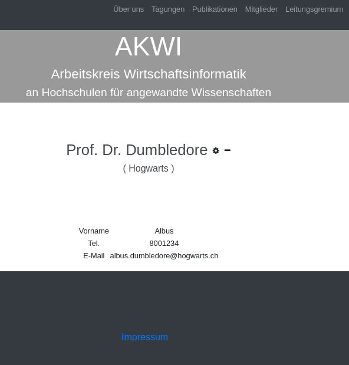

**Person löschen**

Formular-Eingabe

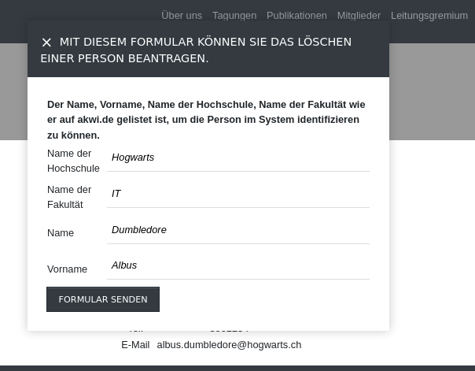

json-String

{\"modus\":\"DeletePerson\",\"formularData\":{\"legalName\":\"Hogwarts\",\"name\":\"IT\",\"familyName\":\"Dumbledore\",\"givenName\":\"Albus\"}}

Resultat

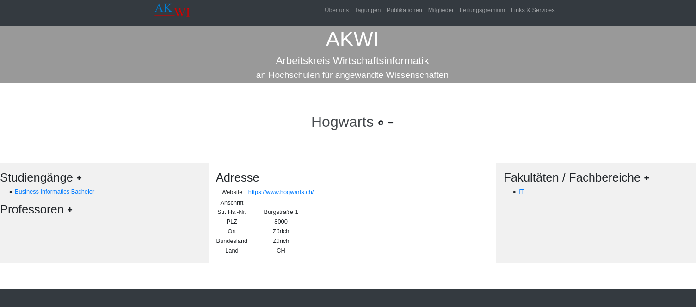

**Studiengang löschen**

Formular-Eingabe

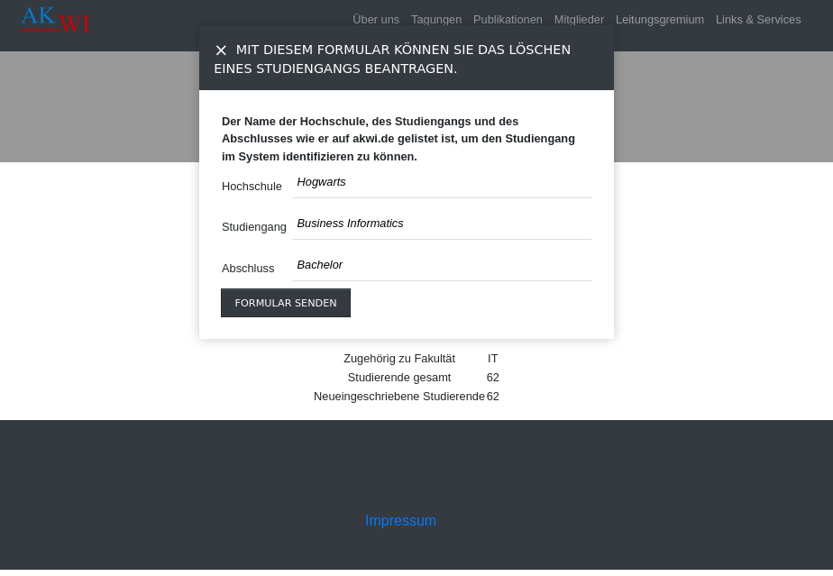

json-String

{\"modus\":\"DeleteCourse\",\"formularData\":{\"legalName\":\"Hogwarts\",\"name\":\"Business
Informatics\",\"targetName\":\"Bachelor\"}}

Resultat

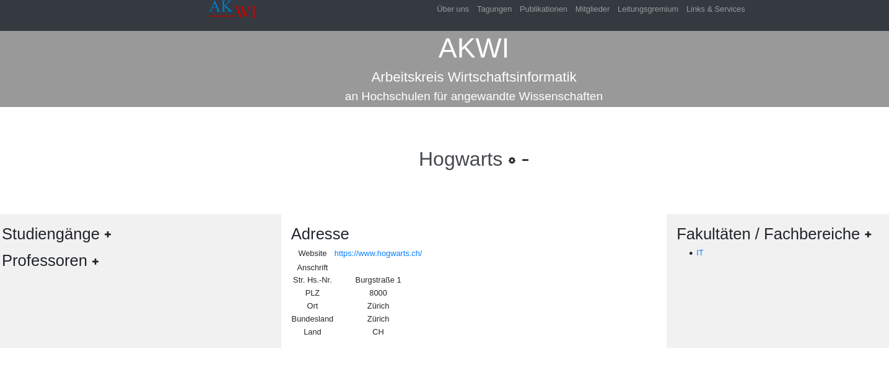

**Fakultät löschen**

[Formular-Eingabe]

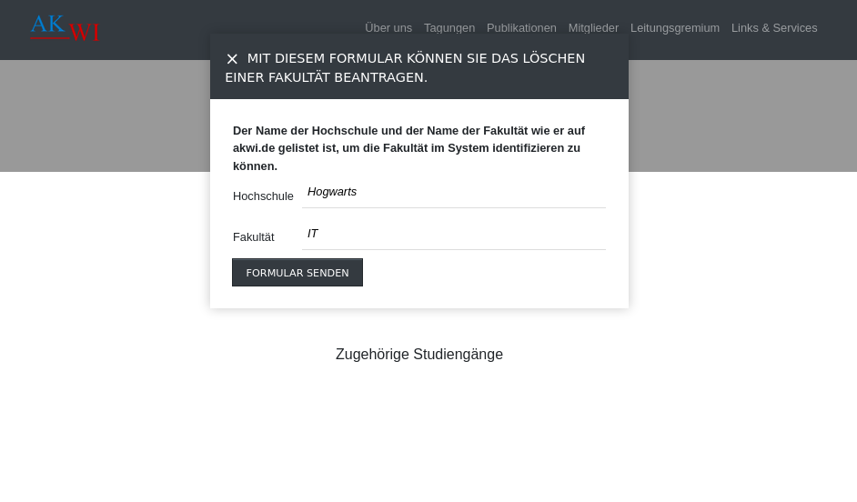

[json-String]

{\"modus\":\"DeleteDepartmentOrFaculty\",\"formularData\":{\"legalName\":\"Hogwarts\",\"name\":\"IT\"}}

Resultat

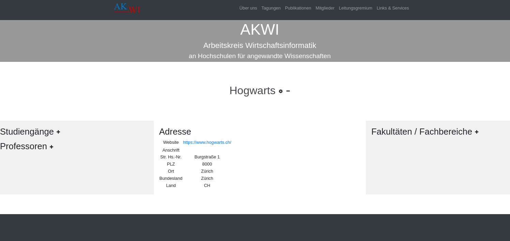

**Hochschule löschen**

Formular-Eingabe

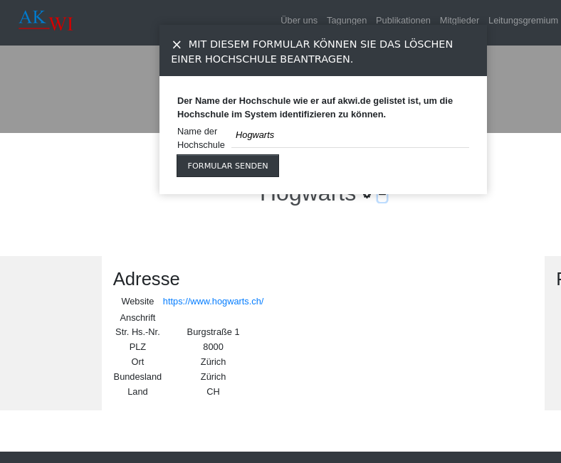

json-String

{\"modus\":\"DeleteCollegeOrUniversity\",\"formularData\":{\"legalName\":\"Hogwarts\"}}

Resultat

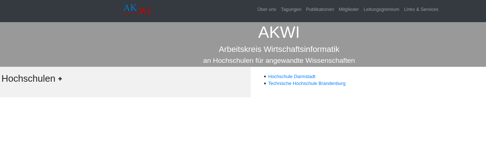

Hierarchie - Beschränkungen beim Einfügen und Löschen 
-----------------------------------------------------
Die folgenden Regeln werden von der Web-Anwendung AkwiJsonToFuseki
berücksichtigt, um den Datenbestand im RDF Schema konsistent zu halten.
Durch die Regeln beim Löschen von Datenbeständen wird vermieden, dass
leere Referenzen entstehen, die auf nicht mehr vorhandene Objekte
(Triple) verweisen. Es werden folgende Constraints für das Löschen und
Einfügen von Datenbeständen eingeführt.

**Regeln zum Einfügen (Hierarchie)**
\- Beim Einfügen einer Person wird eine Referenz auf ein
DeparmentsOrFaculty benötigt

\- Beim Einfügen eines Course wird eine Referenz auf ein
DeparmentsOrFaculty benötigt

\- Beim Einfügen von DeparmentsOrFaculty wird eine Referenz auf eine
University benötigt

\- University kann immer eingefügt werden

\- Es können keine Elemente doppelt eingefügt werden

**Regeln zum Löschen (Hierarchie)**
\- Immer, wenn eine Person gelöscht wird, wird die Referenz in der
zugehörigen DepartmentOrFaculty auf die Person mit gelöscht

\- Kurse werden gelöscht

\- DepartmentOrFaculty kann nur gelöscht werden, wenn kein Course oder
Person mehr vorhanden sind, die zum DepartmentOrFaculty gehören

\- Immer, wenn ein DepartmentOrFaculty gelöscht wird, wird die Referenz
in der zugehörigen University auf das DepartmentOrFaculty mit gelöscht

\- CollegeOrUniversity kann erst gelöscht werden, wenn keine Departments
vorhanden sind, die zur University gehören
